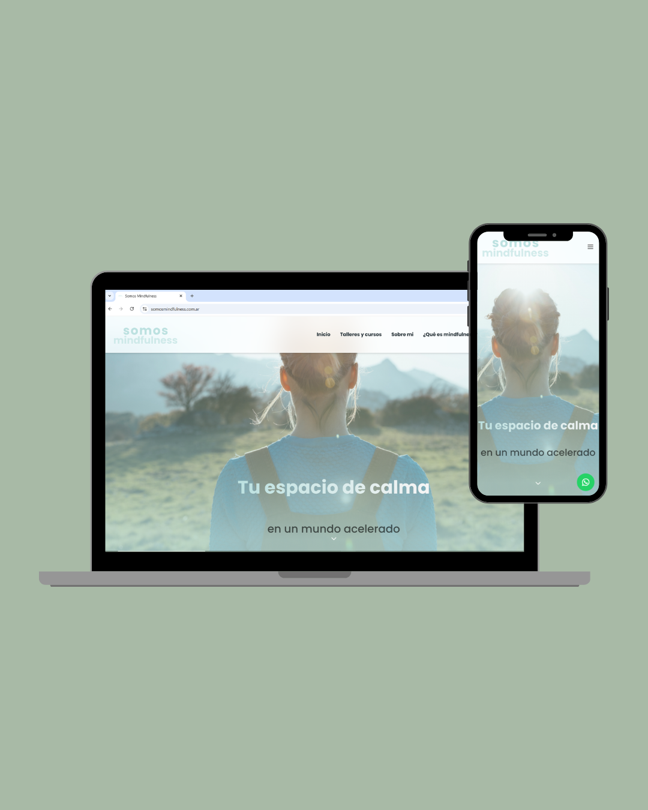
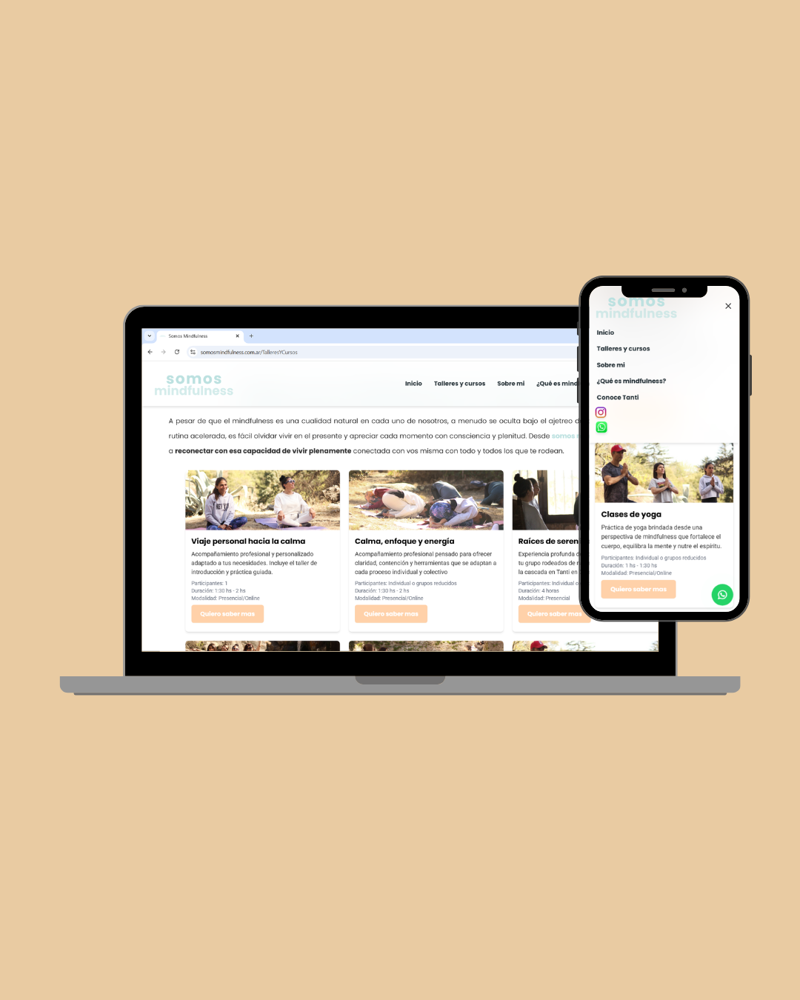
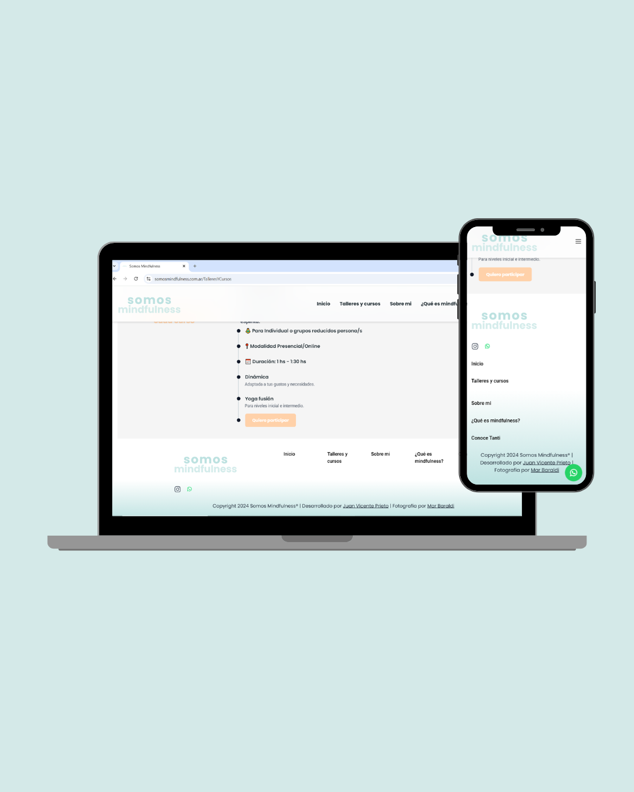

# 🧘‍♀️ Somos Mindfulness - Web & Brand Identity

> **Nota:** Este es un repositorio "vitrina" para presentar el trabajo realizado. El código fuente original es privado por acuerdo comercial con el cliente.

---

## 📖 Sobre el Proyecto

**Cliente:** Daniela Crespo, Guía de Meditación y Yoga.

El objetivo principal fue transformar un emprendimiento personal en una marca digital sólida. La clienta necesitaba una plataforma que no solo informara sobre sus servicios, sino que transmitiera la "seriedad" y profesionalismo de su práctica, diferenciándose en un mercado competitivo.

El resultado es una **SPA (Single Page Application)** rápida, estética y autogestionable que sirve como el centro de operaciones digital para sus cursos y retiros.

---

## 📸 Galería del Proyecto

| Home  |
|:---:|
|  |

| Cursos |
|:---:|
|  |

| Footer |
|:---:|
|  |

---

## 🚀 Desafío Técnico: CMS Personalizado "No-Code"

El mayor reto no fue el diseño, sino la **usabilidad post-entrega**. La clienta necesitaba actualizar la información de talleres, contenido y textos sin depender de un desarrollador y sin aprender a usar paneles complejos como WordPress o Strapi.

**La Solución:**
Implementé una arquitectura donde **Google Sheets actúa como Base de Datos y CMS**.
1. La clienta edita una hoja de cálculo simple (algo que ya sabe usar).
2. La web consume esos datos vía API en tiempo real.
3. El contenido se actualiza en el frontend instantáneamente.

> *Esto redujo la fricción de mantenimiento a cero y empoderó a la clienta para gestionar su negocio con autonomía.*

Puedes ver la lógica de conexión y parseo de datos aquí:
👉 **[Ver Snippet: googleSheetService.js](./snippets/googleSheetService.js)**

---

## 🛠️ Mi Rol: Gestión de Ciclo Completo (End-to-End)

Como único responsable del proyecto, gestioné todas las etapas del desarrollo de software y producto:

* **Consultoría & Negocio:** Relevamiento de requisitos, armado de presupuesto y contrato legal.
* **Identidad de Marca:** Diseño desde cero del Logo, paleta de colores y tipografías (Branding).
* **Diseño UX/UI:** Prototipado de alta fidelidad en **Figma**.
* **Desarrollo Frontend:** Construcción de la interfaz con **React** y **Tailwind CSS**.
* **Infraestructura:** Configuración de dominio y despliegue continuo en **Vercel**.

---

## 💻 Stack Tecnológico

* **Frontend:** React.js
* **Estilos:** Tailwind CSS (Diseño Responsive First)
* **Base de Datos / CMS:** Google Sheets API
* **Diseño:** Figma
* **Deploy:** Vercel

---

### ¿Te interesa ver cómo estructuro mi código?
Aunque este repo es una vitrina, tengo proyectos Open Source que puedes ver en mi perfil:
👉 [Ver mi perfil de GitHub](https://github.com/juanivp)